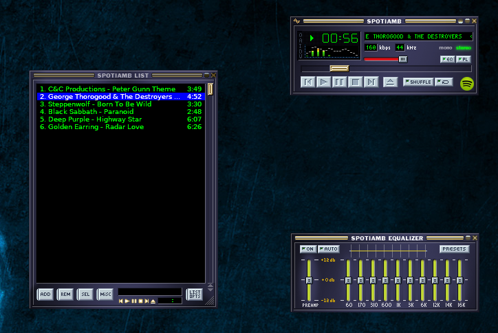
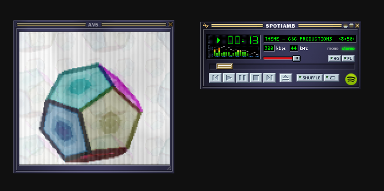
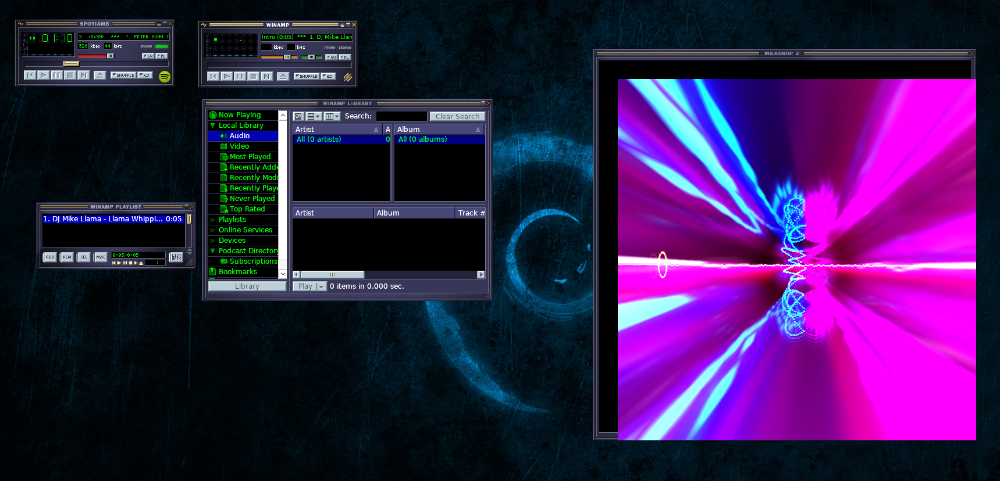

# Spotiamb: Winamp + Spotify on Linux

Winamp is the GOAT of music players from the 1990s. To honour it, someone at Spotify releases a small project called Spotiamb. It's a visually identical copy of Winamp but connects to Spotify to play music. This project configures those Windows binaries to run "out of the box" on Linux

Spotiamp supports AVS visualisations.

We also throw in a copy of the original Winamp as well.

## Screenshots





## Getting it to work

1. Clone this repository:

```bash
git clone git@github.com:PhillipTaylor/spotiamb.git
```
2. Build the spotiamp docker image locally:

```bash
cd spotiamb
docker build -t docker-spotiamb .    # image name must be this
```

3. Run the script on your host machine which kicks off the docker image and wires up PulseAudio and X11 for you when it starts Spotiamb inside the container

```bash
./docker-spotiamb spotiamb      # starts spotiamb
```

Other useful commands:

```bash
./docker-spotiamb winamp          # starts winamp
./docker-spotiamb winecfg         # if audio doesn't work at first (see audio tab and use test button)
./docker-spotiamb winetricks      # if AVS doesn't work, maybe install direct x 9.
```

### FAQ: Why Docker?

A: Spotiamb is a 32 bit Windows application. Without docker you need your operating system to provide all the 32 bit audio libraries and a 32 bit copy of Wine. The docker image means you don't have to bother with any of that junk and means you can easy run Spotiamb on Linux.

### FAQ: What's this script I have to run? I thought it was Docker?

The script downloads the docker image and sets up all the parameters for X11 and PulseAudio to work correctly. Without it sounds doesn't work.

Everything to do with that is taken from the upstream repository:

https://github.com/scottyhardy/docker-wine

I just bundle some Spotiamb / Winamp dlls on top of it.

### FAQ: Why doesn't it work for me?

If you can't log in its because you need a Spotify Premium account.

### FAQ: Some stuff isn't working.

Spotiamb has a lot of missing features. You can't play regular MP3s, open folders, remove files from playlists. It sometimes crashes. That's the state the Spotiamb app was in at version 0.21.

All I'm doing is shipping docker + wine + bundle some closed source code someone else wrote together. I can't actually fix any bugs.

### FAQ: Is it spotiamp or spotiamb?

It was originally Spotiamp but got renamed to Spotiamb after Winamp claimed anything ending in "amp" belongs to them.

### FAQ: Where is my Spotify password being stored?

It's unencrypted in the docker volume called `winehome`, available on your host machine and to the container. The file is called `Spotiamb.ini`.

### FAQ: There's no sound.

Try configuring your settings here, then restarting the app:

```bash
./docker-spotiamb winecfg
```
Try going to the Audio tab and choosing "Pulse Audio". There's also an "output device" setting in Spotiamb to jiggling with.

You can also try rerunning the installer which is in the git repo:

```bash
docker cp installer/Spotiamb_0.2.1_Setup.exe spotiamb:/
docker exec --it spotiamb /bin/bash
container> wine /Spotiamb_0.2.1_Setup.exe
```

Good luck guys.

Phillip Taylor

